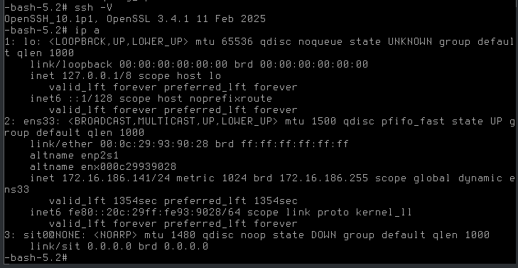

# 后续
<font color=red>**该文档是基于lfs12文档版本上写的，在lfs13版本上 执行时出现错误(应该不会出现问题)请自行排查**</font>

## 安装openssh
```shell
现在已经进来了LFS中，即在LFS中操作

# 在LFS中安装libedit
[root@lfs ~]# cd /sources 
[root@lfs /sources]# tar -zxvf libedit-20251016-3.1.tar.gz
[root@lfs /sources]# cd libedit-20251016-3.1
[root@lfs /sources/libedit-20251016-3.1]# ./configure --prefix=/usr && make && make install
[root@lfs /sources/libedit-20251016-3.1]# cd .. && rm -rf libedit-20251016-3.1

# 在lfs中安装openssh
[root@lfs /sources]# tar -zxvf openssh-10.1p1.tar.gz
[root@lfs /sources]# cd openssh-10.1p1
[root@lfs /sources/openssh-10.1p1]# ./configure --prefix=/usr --sysconfdir=/etc/ssh \
--with-md5-passwords --with-privsep-path=/var/lib/sshd \
--with-default-path=/usr/bin --with-libedit --with-ssl-dir=/usr
关键点提醒：
--with-libedit：正如你之前要求的，启用高级命令行编辑功能
--with-privsep-path：这是安全隔离目录，必须存在

注意：缺少依赖报错：如果在 configure 时报错找不到 zlib 或 openssl，请确认你是否已经安装了这两个包

[root@lfs /sources/openssh-10.1p1]# make && make install
注意: 此时会报一个所谓的错，这个不影响


# 查看ssh版本
[root@lfs /sources/openssh-10.1p1]# ssh -V
OpenSSH_10.1P1, OpenSSL 3.4.1 11 Feb 2025


# 将SSH做成Systemd服务
1、创建必要目录和用户
install  -v -m700 -d /var/lib/sshd
chown    -v root:sys /var/lib/sshd
groupadd -g 50 sshd
useradd  -c 'sshd PrivSep' -d /var/lib/sshd -g sshd -s /bin/false -u 50 sshd

2、编写服务文件
vim /etc/systemd/system/sshd.service
[Unit]
Description=OpenSSH Daemon
After=network.target

[Service]
Type=simple
ExecStart=/usr/sbin/sshd -D
ExecReload=/bin/kill -HUP $MAINPID
KillMode=process
Restart=on-failure

[Install]
WantedBy=multi-user.target


# 允许root登陆
vim /etc/ssh/sshd_config
PermitRootLogin yes


systemctl daemon-reload
systemctl enable sshd && systemctl start sshd

如启动时报错则需要手动测试
/usr/sbin/sshd -t

生成主机密钥（必须做）
在 Chroot 或 LFS 系统内执行：
ssh-keygen -A


```



```shell
# 现在就能用ssh连接上，所以下面的一切有了PS1的提示符

为什么SSH登录后 ip a 找不到命令？
这是一个非常经典的 环境变量（PATH）隔离问题。

根本原因：PATH 变量不一致
在Linux 中，ip 命令通常位于 /usr/sbin/ip 或 /sbin/ip
宿主机/本地登录：你的 PATH 可能包含了 /usr/sbin
SSH 登录：当你通过 SSH 进入时，系统会读取你在 LFS 内部设置的 /etc/profile 或 ~/.bash_profile。如果这些文件里定义的 PATH 只有 /usr/bin 而没有 /usr/sbin，系统就找不到ip命令

验证方法：
在SSH终端里执行：echo $PATH
你会发现结果里很可能缺少了 /usr/sbin


# 修改/添加PATH声明，如果不修改/添加则会出现在宿机上的LFS中和ssh连接进来后执行echo $PATH的结果就会不一样
[root@lfs ~]# echo "export PATH=/usr/bin:/usr/sbin" | tee /etc/profile
export PATH=/usr/bin:/usr/sbin

[root@lfs ~]# source /etc/profile

# 查看IP
[root@lfs ~]# ip a sh ens33
2: ens33: <BROADCAST,MULTICAST,UP,LOWER_UP> mtu 1500 qdisc pfifo_fast state UP group default qlen 1000
    link/ether 00:0c:29:93:90:28 brd ff:ff:ff:ff:ff:ff
    altname enp2s1
    altname enx000c29939028
    inet 172.16.186.147/24 metric 1024 brd 172.16.186.255 scope global dynamic ens33
       valid_lft 1613sec preferred_lft 1613sec
    inet6 fe80::20c:29ff:fe93:9028/64 scope link proto kernel_ll 
       valid_lft forever preferred_lft forever


```


## 修改PS1
```shell
# 在宿主机操作时路径要加上$LFS,比如cat > $LFS/etc/bashrc << "EOF"...
(lfs chroot) I have no name!:/# cat > /etc/bashrc << "EOF"
# /etc/bashrc

# 颜色定义
CYAN='\[\e[36m\]'
GREEN='\[\e[32m\]'
PURPLE='\[\e[35;1m\]'
RESET='\[\e[0m\]'

# 苹果风格温和配色PS1
# \u:用户名 \h:主机名 \w:完整路径 (解决你看不见路径的问题)
export PS1="${CYAN}\u${RESET}@${GREEN}\h${RESET}:${PURPLE}\w${RESET}\$ "

alias ls='ls --color=auto'
alias ll='ls -l'
EOF


# 设置全局 profile (所有用户登录的入口)
(lfs chroot) I have no name!:/# cat > /etc/profile << "EOF"
if [ -f /etc/bashrc ]; then
  . /etc/bashrc
fi
EOF

# 设置 root 用户的个人配置
(lfs chroot) I have no name!:/# cat > /root/.bash_profile << "EOF"
if [ -f /etc/bashrc ]; then
  . /etc/bashrc
fi
EOF


-bash-5.2# source ~/.bash_profile

# 可以看到PS1已经改变
root@lfs:~$ cd /etc/
root@lfs:/etc$

```


# 设置网络
```shell
root@lfs:/etc$ ip a
1: lo: <LOOPBACK,UP,LOWER_UP> mtu 65536 qdisc noqueue state UNKNOWN group default qlen 1000
    link/loopback 00:00:00:00:00:00 brd 00:00:00:00:00:00
    inet 127.0.0.1/8 scope host lo
       valid_lft forever preferred_lft forever
    inet6 ::1/128 scope host noprefixroute 
       valid_lft forever preferred_lft forever
2: ens33: <BROADCAST,MULTICAST,UP,LOWER_UP> mtu 1500 qdisc pfifo_fast state UP group default qlen 1000
    link/ether 00:0c:29:93:90:28 brd ff:ff:ff:ff:ff:ff
    altname enp2s1
    altname enx000c29939028
    inet 172.16.186.141/24 metric 1024 brd 172.16.186.255 scope global dynamic ens33
       valid_lft 1768sec preferred_lft 1768sec
    inet6 fe80::20c:29ff:fe93:9028/64 scope link proto kernel_ll 
       valid_lft forever preferred_lft forever
3: sit0@NONE: <NOARP> mtu 1480 qdisc noop state DOWN group default qlen 1000
    link/sit 0.0.0.0 brd 0.0.0.0


root@lfs:/etc$ grep 172 /etc/resolv.conf 
nameserver 172.16.186.2

root@lfs:/etc$ ping -c2 172.16.186.2
PING 172.16.186.2 (172.16.186.2): 56 data bytes
64 bytes from 172.16.186.2: icmp_seq=0 ttl=128 time=0.455 ms
64 bytes from 172.16.186.2: icmp_seq=1 ttl=128 time=0.344 ms
--- 172.16.186.2 ping statistics ---
2 packets transmitted, 2 packets received, 0% packet loss
round-trip min/avg/max/stddev = 0.344/0.400/0.455/0.056 ms

root@lfs:/etc$ ping -c2 youku.com
PING youku.com (106.11.40.57): 56 data bytes
64 bytes from 106.11.40.57: icmp_seq=0 ttl=128 time=24.541 ms
64 bytes from 106.11.40.57: icmp_seq=1 ttl=128 time=24.418 ms
--- youku.com ping statistics ---
2 packets transmitted, 2 packets received, 0% packet loss
round-trip min/avg/max/stddev = 24.418/24.480/24.541/0.061 ms


# 当前使用的DHCP获取的IP,改成用静态的IP,当静态IP异常时再用dhcp获取IP（文件名10-eth-static.network未改名）
root@lfs:~$ mv /etc/systemd/network/10-eth-dhcp.network  /etc/systemd/network/20-eth-dhcp.network
root@lfs:~$ systemctl restart systemd-networkd

```


# 解决"源码安装"焦虑的实战方案：DESTDIR机制
```shell
既然已经连上ssh了，我教你一招最能启发“包管理”思路的操作，叫 DESTDIR 安装法。这是所有 .deb 或 .rpm 制作的基石
试着在ssh里操作一次（以安装一个小工具如 vim 为例）：
编译时不要直接 make install
执行 make DESTDIR=/tmp/vim-pkg install
去 /tmp/vim-pkg 看看，你会发现它生成了一个完整的、带路径的目录结构
感悟： 如果你把这个文件夹打成 vim.tar.gz，发给别人，别人只需要解压到根目录 /，不就实现了类似 apt 的安装效果吗？所谓的包管理器，本质上就是一套"自动下载压缩包并解压到对应位置"的逻辑

该项未测试

```


# 从lfs基础环境到BLFS功能增强，最终实现Pacman包管理器移植的硬核全过程
## BLFS(Beyond Linux From Scratch)环境增强(底层支持)
```shell
在移植Pacman之前必须先打通网络(curl)与信任链(CA),这是后续所有下载和校验的根基

1. 网络与底层库 (libpsl & curl)
# 安装curl (必须)
需要先安装libpsl(curl的依赖)
[root@lfs /sources]# tar zxvf libpsl-0.21.5.tar.gz
[root@lfs /sources]# cd libpsl-0.21.5
[root@lfs /sources/libpsl-0.21.5]# ./configure --prefix=/usr --disable-static && make -j$(nproc) && make install
[root@lfs /sources/libpsl-0.21.5]# cd .. && rm -rf libpsl-0.21.5

[root@lfs /sources]# tar -xf curl-8.20.0.tar.gz
[root@lfs /sources]# cd curl-8.20.0
[root@lfs /sources/curl-8.20.0]# ./configure --prefix=/usr --disable-static --with-openssl
[root@lfs /sources/curl-8.20.0]# make -j$(nproc) && make install
[root@lfs /sources/curl-8.20.0]# cd .. && rm -rf curl-8.20.0

2. 证书与信任链 (CA-Certificates)
[root@lfs /sources]# tar zxvf make-ca-1.16.1.tar.gz
[root@lfs /sources]# cd make-ca-1.16.1
[root@lfs /sources/make-ca-1.16.1]# make install
[root@lfs /sources/make-ca-1.16.1]# cd ..

# 安装p11-kit (证书分发引擎)
[root@lfs /sources]# tar xvf p11-kit-0.26.2.tar.xz
[root@lfs /sources]# cd p11-kit-0.26.2
[root@lfs /sources/p11-kit-0.26.2]# cd build/
[root@lfs /sources/p11-kit-0.26.2/build]# meson setup --prefix=/usr --buildtype=release -Dtrust_paths=/etc/pki/anchors 
[root@lfs /sources/p11-kit-0.26.2/build]# ninja && ninja install
[root@lfs /sources/p11-kit-0.26.2/build]# ln -sfv /usr/libexec/p11-kit/trust-extract-compat    /usr/bin/update-ca-certificates
[root@lfs /sources/p11-kit-0.26.2/build]# cd ../.. &&  rm -rf p11-kit-0.26.2


OpenSSL默认寻找证书的路径可能与 make-ca 生成的不一致，所以需要做一个"严丝合缝"的对接:
# 确保目录存在
[root@lfs /sources]# mkdir -pv /etc/ssl/certs
从其他机器上把ca-certificates.crt发送到上一行创建的目录中
[其他机器@root ~]# scp /etc/ssl/certs/ca-certificates.crt root@172.16.186.147:/etc/ssl/certs/        # 147是lfs的ip

# 建立OpenSSL默认寻找的软链接
[root@lfs /sources]# ln -sfv /etc/ssl/certs/ca-certificates.crt /etc/ssl/certs/cert.pem

# 自动生成哈希链接（lfs13应该有c_rehash命令，它是openssl的一部分）
[root@lfs /sources]# c_rehash /etc/ssl/certs

# 仅仅是更新系统信任存储(基于你已经生成的证书数据)
[root@lfs /sources]# /usr/sbin/make-ca -u -w

# 如果是想彻底重新生成(类似之前的流程)
[root@lfs /sources]# /usr/sbin/make-ca -g -c certdata.txt


```


## pacman核心依赖(GnuPG协议栈)
```shell
在(lfs chroot)环境或SSH远程连接中，确保你有基本的编译环境。你需要预先准备好以下源码包(建议在宿主机下载后通过scp拷贝到LFS的/sources目录),我是提前下载好了的:
libarchive (核心依赖，处理压缩包)
curl (负责网络下载)
libgpg-error (底层错误码定义)
libassuan (IPC 通信库)
gpgme (主程序接口)
gpgme (负责软件包签名验证)
pacman (主程序)

第一步: 编译核心依赖
# 安装libarchive (必须)
pacman 使用它来读取 .pkg.tar.zst 格式的包
[root@lfs ~]# cd /sources/
[root@lfs /sources]# tar xvf libarchive-3.8.7.tar.xz
[root@lfs /sources]# cd libarchive-3.8.7
[root@lfs /sources/libarchive-3.8.7]# ./configure --prefix=/usr --disable-static
[root@lfs /sources/libarchive-3.8.7]# make -j$(nproc) && make install
[root@lfs /sources/libarchive-3.8.7]# cd .. && rm -rf libarchive-3.8.7

# 安装gpgme 
如果你想验证Arch官方包的安全性就需要它
[root@lfs /sources]# tar zxvf libgpg-error-1.61.tar.gz
[root@lfs /sources]# cd libgpg-error-1.61
[root@lfs /sources/libgpg-error-1.61]# ./configure --prefix=/usr --disable-static && make -j$(nproc) && make install
[root@lfs /sources/libgpg-error-1.61]# cd .. && rm -rf libgpg-error-1.61


[root@lfs /sources]# tar jxvf libgcrypt-1.11.0.tar.bz2
[root@lfs /sources]# cd libgcrypt-1.11.0
[root@lfs /sources/libgcrypt-1.11.0]# ./configure --prefix=/usr --with-libgpg-error-prefix=/usr && make -j$(nproc) && make install
[root@lfs /sources/libgcrypt-1.11.0]# cd .. && rm -rf libgcrypt-1.11.0


[root@lfs /sources]# tar jxvf libassuan-3.0.2.tar.bz2
[root@lfs /sources]# cd libassuan-3.0.2
[root@lfs /sources/libassuan-3.0.2]# ./configure --prefix=/usr --disable-static && make -j$(nproc) && make install
[root@lfs /sources/libassuan-3.0.2]# cd .. && rm -rf libassuan-3.0.2

[root@lfs /sources]# tar jxvf libksba-1.7.0.tar.bz2
[root@lfs /sources]# cd libksba-1.7.0
[root@lfs /sources/libksba-1.7.0]# ./configure --prefix=/usr && make -j$(nproc) && make install
[root@lfs /sources/libksba-1.7.0]# cd .. && rm -rf libksba-1.7.0

[root@lfs /sources]# tar jxvf npth-1.7.tar.bz2
[root@lfs /sources]# cd npth-1.7
[root@lfs /sources/npth-1.7]# ./configure --prefix=/usr && make -j$(nproc) && make install
[root@lfs /sources/npth-1.7]# cd .. && rm -rf npth-1.7


[root@lfs /sources]# tar jxvf gpgme-2.0.1.tar.bz2
[root@lfs /sources]# cd gpgme-2.0.1
[root@lfs /sources/gpgme-2.0.1]# ./configure --prefix=/usr --disable-gpg-test && make -j$(nproc) && make install
[root@lfs /sources/gpgme-2.0.1]# cd .. && rm -rf gpgme-2.0.1


[root@lfs /sources]# tar xvf gnupg-w32-2.5.19_20260424.tar.xz
[root@lfs /sources]# cd gnupg-w32-2.5.19
[root@lfs /sources/gnupg-w32-2.5.19]# ./configure --prefix=/usr  --sysconfdir=/etc  --enable-all-tests && make -j$(nproc) && make install
检验
[root@lfs /sources/gnupg-w32-2.5.19]# gpg --version
gpg (GnuPG) 2.5.19
libgcrypt 1.11.0
Copyright (C) 2025 g10 Code GmbH
License GNU GPL-3.0-or-later <https://gnu.org/licenses/gpl.html>
This is free software: you are free to change and redistribute it.
There is NO WARRANTY, to the extent permitted by law.

Home: /root/.gnupg
Supported algorithms:
Pubkey: RSA, Kyber, ELG, DSA, ECDH, ECDSA, EDDSA
Cipher: IDEA, 3DES, CAST5, BLOWFISH, AES, AES192, AES256, TWOFISH,
        CAMELLIA128, CAMELLIA192, CAMELLIA256
Hash: SHA1, RIPEMD160, SHA256, SHA384, SHA512, SHA224
Compression: Uncompressed, ZIP, ZLIB, BZIP2


[root@lfs /sources/gnupg-w32-2.5.19]# cd .. && rm -rf gnupg-w32-2.5.19

```


## 正式移植pacman
```shell
获取Arch Linux官方维护的密钥环数据文件
[root@lfs /sources]# curl -k -O https://mirrors.edge.kernel.org/archlinux/core/os/x86_64/archlinux-keyring-20260420-1-any.pkg.tar.zst
[root@lfs /sources]# tar --use-compress-program=zstd -xvf archlinux-keyring-20260420-1-any.pkg.tar.zst -C  /
注意:
操作会将密钥环文件放入 /usr/share/pacman/keyrings/

pacman现在使用meson进行构建(LFS13默认应该已经带了python/meson)
[root@lfs /sources]# tar zxvf pacman-v7.1.0.tar.gz
[root@lfs /sources]# cd pacman-v7.1.0
[root@lfs /sources/pacman-v7.1.0]# mkdir build && cd build
配置Meson:
你需要告诉它配置文件和数据库放在哪里
[root@lfs /sources/pacman-v7.1.0/build]# meson setup --prefix=/usr \
--sysconfdir=/etc --localstatedir=/var \
-Ddoc=disabled -Dcrypto=openssl ..
编译并安装：
[root@lfs /sources/pacman-v7.1.0/build]# ninja && ninja install


# 配置与激活
安装完程序后，它还只是个空壳，你需要给它"注入灵魂"
# 创建必要的路径
[root@lfs /sources/pacman-v7.1.0/build]# mkdir -p /var/lib/pacman && mkdir -p /var/cache/pacman/pkg
# 编辑镜像源 
[root@lfs /sources/pacman-v7.1.0/build]# vim /etc/pacman.conf
[options]
SigLevel = Required DatabaseOptional
LocalFileSigLevel = Optional
RemoteFileSigLevel = Required

# 核心锁定：防止pacman自动化覆盖你的lfs成果
IgnorePkg = glibc gcc binutils bash coreutils linux linux-headers systemd openssl openssh

# 添加Arch Linux的软件仓库。在文件末尾添加
[core]
Server = https://mirrors.kernel.org/archlinux/$repo/os/x86_64
[extra]
Server = https://mirrors.kernel.org/archlinux/$repo/os/x86_64
注: 由于LFS不是标准的Arch，$arch建议直接写死成x86_64


# 初始化密钥对
[root@lfs /sources/pacman-v7.1.0]# pacman-key --init
gpg: /etc/pacman.d/gnupg/trustdb.gpg: trustdb created
gpg: no ultimately trusted keys found
gpg: starting migration from earlier GnuPG versions
gpg: porting secret keys from '/etc/pacman.d/gnupg/secring.gpg' to gpg-agent
gpg: migration succeeded
==> Generating pacman master key. This may take some time.
gpg: Generating pacman keyring master key...
gpg: directory '/etc/pacman.d/gnupg/openpgp-revocs.d' created
gpg: revocation certificate stored as '/etc/pacman.d/gnupg/openpgp-revocs.d/B840B506A208742EA3080EC0B0BD80115DB13954.rev'
gpg: Done
==> Updating trust database...
gpg: marginals needed: 3  completes needed: 1  trust model: pgp
gpg: depth: 0  valid:   1  signed:   0  trust: 0-, 0q, 0n, 0m, 0f, 1u


[root@lfs /sources/pacman-v7.1.0]# pacman-key --populate archlinux
==> Appending keys from archlinux.gpg...
==> Locally signing trusted keys in keyring...
  -> Locally signed 5 keys.
==> Importing owner trust values...
gpg: setting ownertrust to 4
gpg: setting ownertrust to 4
gpg: setting ownertrust to 4
gpg: inserting ownertrust of 4
gpg: setting ownertrust to 4
==> Disabling revoked keys in keyring...
  -> Disabled 38 keys.
==> Updating trust database...
gpg: Note: third-party key signatures using the SHA1 algorithm are rejected
gpg: (use option "--allow-weak-key-signatures" to override)
gpg: marginals needed: 3  completes needed: 1  trust model: pgp
gpg: depth: 0  valid:   1  signed:   5  trust: 0-, 0q, 0n, 0m, 0f, 1u
gpg: depth: 1  valid:   5  signed:  86  trust: 0-, 0q, 0n, 5m, 0f, 0u
gpg: depth: 2  valid:  74  signed:  18  trust: 74-, 0q, 0n, 0m, 0f, 0u
gpg: next trustdb check due at 2026-10-21


现在pacman就真正具备了验证Arch官方包的能力
但请务必注意：
由于LFS的系统结构(比如/lib还是/lib64的链接方式)可能与Arch略有不同，当你第一次尝试pacman -Syu或者安装大型软件(如gcc)时，千万不要直接按Y
先看依赖: 看看它会不会尝试替换之前的 Glibc 或 Binutils

策略: 建议初期只用pacman安装一些非核心的工具(如htop, neofetch, tree等），核心库依然保持手动源码升级，直到你完全掌握如何配置pacman.conf里的IgnorePkg参数

安装第一个测试包：Neofetch
在安装之前需要让pacman认识云端的软件库
1. 同步数据库
首先让pacman去镜像站下载最新的软件包列表:
[root@lfs /sources/pacman-v7.1.0]# cd
[root@lfs ~]# pacman -Sy
:: Synchronizing package databases...
 core        126.9 KiB  78.3 KiB/s 00:02 [#################################################] 100%
 extra         8.2 MiB  2.86 MiB/s 00:03 [#################################################] 100%


# 查看lfs13的glibc版本
[root@lfs /sources]# ldd --version
ldd (GNU libc) 2.43
Copyright (C) 2024 Free Software Foundation, Inc.
This is free software; see the source for copying conditions.  There is NO
warranty; not even for MERCHANTABILITY or FITNESS FOR A PARTICULAR PURPOSE.
Written by Roland McGrath and Ulrich Drepper.

# 查看arch的glibc的版本
[root@lfs /sources]# pacman -Si glibc
Repository      : core
Name            : glibc
Version         : 2.43+r22+g8362e8ce10b2-2
Description     : GNU C Library
Architecture    : x86_64
URL             : https://www.gnu.org/software/libc
Licenses        : GPL-2.0-or-later  LGPL-2.1-or-later
Groups          : None
Provides        : None
Depends On      : linux-api-headers>=4.10  tzdata  filesystem
Optional Deps   : gd: for memusagestat
                  perl: for mtrace
Conflicts With  : None
Replaces        : None
Download Size   : 10.32 MiB
Installed Size  : 50.35 MiB
Packager        : Frederik Schwan <freswa@archlinux.org>
Build Date      : Fri 01 May 2026 08:33:40 AM UTC
Validated By    : SHA-256 Sum  Signature

注: 
lfs13核心版本与Arch Linux仓库完全对齐。 这意味着你现在安装任何Arch的软件包，二进制兼容性(ABI)几乎是完美的
仓库的Glibc是2026年5月1日构建的，你的lfs也是近期构建的，这种"同龄"系统极少出现编译器版本导致的兼容性Bug


现在还不能正常安装包，因为glibc、libgcc、libstdc++都是通过lfs手动编译的，Pacman的本地数据库里一片空白，它以为你没装这些东西，所以拒绝安装任何依赖它们的软件，以下是解决方法:
[root@lfs /sources]# mkdir -p /sources/lfs-core && cd /sources/lfs-core

# 创建一个包含多个"虚拟提供"的PKGINFO,即创建伪装元数据
[root@lfs /sources/lfs-core]# cat > .PKGINFO << EOF
pkgname = lfs-core-manager
pkgver = 1.0-1
pkgdesc = Meta package to satisfy LFS core dependencies
url = https://www.linuxfromscratch.org
builddate = $(date +%s)
packager = LFS-Builder
size = 0
arch = x86_64
license = GPL
provides = glibc=2.43
provides = libgcc=14.2.0
provides = libstdc++=14.2.0
provides = ncurses=6.5
provides = bash=5.2
EOF


# 重新打包，只包含.PKGINFO
[root@lfs /sources/lfs-core]# tar -cf lfs-core-1.0-1-any.pkg.tar .PKGINFO

# 重新压缩
[root@lfs /sources/lfs-core]# zstd lfs-core-1.0-1-any.pkg.tar

# 强制安装这个影子包（它不含文件，只改数据库）
[root@lfs /sources/lfs-core]# pacman -U lfs-core-1.0-1-x86_64.pkg.tar.zst
loading packages...
resolving dependencies...
looking for conflicting packages...

Packages (1) lfs-core-manager-1.0-1


:: Proceed with installation? [Y/n] y
(1/1) checking keys in keyring                                                        [#################################################] 100%
(1/1) checking package integrity                                                      [#################################################] 100%
(1/1) loading package files                                                           [#################################################] 100%
(1/1) checking for file conflicts                                                     [#################################################] 100%
(1/1) checking available disk space                                                   [#################################################] 100%
:: Processing package changes...
(1/1) installing lfs-core-manager                                                     [#################################################] 100%


[root@lfs /sources/lfs-core]# pacman -S fastfetch
resolving dependencies...
looking for conflicting packages...

Packages (2) yyjson-0.12.0-1  fastfetch-2.62.1-1

Total Installed Size:  2.35 MiB

:: Proceed with installation? [Y/n] y
(2/2) checking keys in keyring                                                        [#################################################] 100%
(2/2) checking package integrity                                                      [#################################################] 100%
(2/2) loading package files                                                           [#################################################] 100%
(2/2) checking for file conflicts                                                     [#################################################] 100%
(2/2) checking available disk space                                                   [#################################################] 100%
:: Processing package changes...
(1/2) installing yyjson                                                               [#################################################] 100%
(2/2) installing fastfetch                                                            [#################################################] 100%
Optional dependencies for fastfetch
    chafa: Image output as ascii art
    dbus: Bluetooth, Player & Media detection
    dconf: Needed for values that are only stored in DConf + Fallback for GSettings
    ddcutil: Brightness detection of external displays
    glib2: Output for values that are only stored in GSettings
    hwdata: GPU output
    imagemagick: Image output using sixel or kitty graphics protocol
    libdrm: Displays detection
    libelf: st term font detection and fast path of systemd version detection
    libglvnd: OpenGL module
    libpulse: Sound detection
    libxrandr: Multi monitor support
    ocl-icd: OpenCL module
    python: Needed for zsh and fish completions
    sqlite: Needed for Sqlite integration and Soar packages count
    vulkan-icd-loader: Vulkan module & fallback for GPU output
    zlib: Faster image output when using kitty graphics protocol


[root@lfs /sources]# fastfetch
            :@@@@@@@:                    root@lfs
            @@@@@@@@@-                   --------
    .:%.    @@@@@@@@@+.       @%         OS: Linux From Scratch 13.0-systemd x86_64
   *@@@%+:  :@@@@@@@%=: .=%@@@@@@=       Host: VMware Virtual Platform
  :@@@@@@##@@@@@@@@@%*+%@%+@@@@@@@+      Kernel: Linux 6.18.10
  @@#####+@@@@@@@%:######=@@@@@@@@@-     Uptime: 3 hours, 46 mins
 *@%######.@@@@@##########-@@@@@@@@#.    Packages: 3 (pacman)
 %@-#.@=:##+@@@@-###%@:=###*@#*+=-+#:    Shell: bash 5.3.0
 @@.#@@*=:#-%%**-##%@@%**####=-          Terminal: /dev/pts/0 10.1p1
 @@-#@@@@+.-...:=.#%@@@@%####-           CPU: 2 x Intel(R) Core(TM) i7-6700HQ (8) @ 2.59 GHz
 %@%##*#:.o.....o...-%@+####@+    -:     GPU: VMware Device 0405 (VGA compatible)
 +@@*#....................+@@@@@@@@+     Memory: 302.39 MiB / 15.61 GiB (2%)
  @%:....................._:@@@@@@@=.    Swap: 0 B / 6.00 GiB (0%)
  .=:...............__*-=`.=@@@@@@#=.    Disk (/): 6.67 GiB / 52.84 GiB (13%) - ext4
   :+:....:==*__*-=`:..==-:#@@@@@%+:     Local IP (eth0): 172.16.186.147/24
     .--=-:  +..::.....-:    =%@*=:      Locale: en_US.UTF-8
              :........-
                .:...--.                                         
                                                                 


如果想让你的lfs13看起来更像一个"真正的发行版",可以尝试安装这些基础工具：
[root@lfs /sources]# pacman -S vim htop git
[root@lfs /sources]# pacman -S pciutils usbutils (查看硬件信息)


# 核心包保护验证
再次确认/etc/pacman.conf里的IgnorePkg是否生效
# 模拟安装 glibc，看它是否会因为 IgnorePkg 而跳过
[root@lfs /sources]# pacman -S glibc
如果提示 "warning: skipping target: glibc"，说明你的防火墙生效了


RHCA的深度提醒：后续如何维护？
A. 保护你的“影子包”
如果以后你手动升级了lfs的 GCC 或 Glibc（比如从2.43升到2.44），记得同步修改你的 .PKGINFO 里的版本号，并重新执行 pacman -U。否则，当你再次安装新包时，Pacman会因为版本太低而报错

B. 处理 .so 缺失（软链接大法）
如果运行某个安装好的包（如 htop）提示：
error while loading shared libraries: libncursesw.so.6: cannot open shared object file
不要慌，也不要用 pacman 去装库。执行以下操作：
ls /usr/lib/libncursesw* 查看你 LFS 手动编译的版本

做个软链接：ln -sv /usr/lib/libncursesw.so.6.x /usr/lib/libncursesw.so.6

C. 保持IgnorePkg
永远不要把 glibc、gcc 等从 /etc/pacman.conf 的 IgnorePkg 里拿掉。它们是你lfs的"主权象征"


```


# 安装docker
```shell
Docker是用Go写的，你的LFS环境现在大概率只有 GCC。你需要先在 LFS 里“套娃”式地安装 Go 语言环境
静态链接与动态链接： 在 LFS 里跑 Docker，最值钱的技术就是把所有依赖都静态链接进去，生成一个放在任何 Linux 上都能跑的二进制文件

# 安装go环境
root@lfs:~$ wget2 https://go.dev/dl/go1.26.2.linux-amd64.tar.gz
root@lfs:~$ tar -zxvf go1.26.2.linux-amd64.tar.gz -C /usr/local
root@lfs:~$ cd /usr/local/go
# 设置引导编译器的路径
root@lfs:~/go$ export GOROOT_BOOTSTRAP=/opt/go
# 设置你最终想安装 Go 的位置
root@lfs:~/go$ export GOROOT=/usr/local/go && export GOPATH=$HOME/go
# 将路径加入 PATH
root@lfs:~/go$ export PATH=$PATH:$GOROOT_BOOTSTRAP/bin:$GOROOT/bin:$GOPATH/bin

# 配置环境变量               # 在文件末尾添加以下内容
root@lfs:~/go$ vim /etc/profile
# Go Root 路径
export GOROOT=/usr/local/go
# Go 工作区路径 (你以后写代码存放的地方)
export GOPATH=$HOME/go
# 将 Go 的二进制目录加入系统 PATH
export PATH=$PATH:$GOROOT/bin:$GOPATH/bin


root@lfs:~/go$ source /etc/profile

# 针对 LFS 的动态链接库检查
这是 LFS 玩家最容易踩的坑。Go的预编译二进制包是基于特定的 Glibc 版本编译的。
root@lfs:~/go$ ldd /usr/local/go/bin/go

root@lfs:~/go$ go version
go version go1.26.2 linux/amd64

```


# 重新修改内核
```shell
root@lfs:~$ cd /sources/linux-6.13.4
root@lfs:/sources/linux-6.13.4$ make menuconfig

# 开启内存控制 (General setup)
General setup  ---> [*] Control Group support  ---> [*] Memory controller

# 开启关键网络支持 (Device Drivers -> Network device support)
<*>     Virtual ethernet pair device                   # 这是容器连接外部世界的"网线"
<*>     MAC-VLAN support

# 开启网络协议支持 (Networking support -> Networking options)
搜索BRIDGE：勾选 802.1d Ethernet Bridging (CONFIG_BRIDGE)。这是容器虚拟交换机的核心
<*> 802.1d Ethernet Bridging

勾选 LLC 和 STP (通常会自动勾选)。
    <*> ANSI/IEEE 802.2 LLC type 2 Suppor
    [*] Network packet filtering framework (Netfilter)  ---> <*>   Ethernet Bridge tables (ebtables) support  ---> <*>  ebt: STP filter support

搜索NETFILTER_XT_MATCH_IPVS：勾选相关的IPVS支持（用于集群负载均衡）
Network packet filtering framework (Netfilter) --> Core Netfilter Configuration --> -*- Netfilter Xtables support (required for ip_tables)

开启存储驱动 (File systems)
搜索 OVERLAY_FS：
File systems  ---> <*> Overlay filesystem support                 # 这是 Docker 默认的文件层叠加技术

配置CONFIG_BRIDGE_NETFILTER。没有它，Docker 的网络隔离和防火墙规则（iptables）可能会失效
Networking support -> Networking options -> Network packet filtering framework (Netfilter) -> Advanced netfilter configuration -> Bridged IP/ARP packets filtering

为了区分新旧内核，在 make menuconfig 的 General setup 里的 Local version - append to kernel release 输入 -docker


保存退出
root@lfs:/sources/linux-6.13.4$ make -j$(nproc)
root@lfs:/sources/linux-6.13.4$ make modules_install
root@lfs:/sources/linux-6.13.4$ cp -v arch/x86/boot/bzImage   /boot/vmlinuz-6.13.4-lfs-12.3-systemd-docker


root@lfs:/sources/linux-6.13.4$ vim /boot/grub/grub.cfg
....
  ....
### 这一段是你的新内核（Docker专用） ###
menuentry 'GNU/Linux (Docker Kernel)' --class gnu-linux --class gnu --class os {
        load_video
        insmod gzio
        insmod part_gpt
        insmod ext2
        set root='hd1,gpt3'
        search --no-floppy --fs-uuid --set=root a21cd4a8-f0f6-4d13-8c95-be53f4311b7c
        echo    'Loading Linux 6.13.4-lfs-12.3-systemd-docker ...'
        # 指向你刚才编译的新内核文件
        linux   /boot/vmlinuz-6.13.4-lfs-12.3-systemd-docker  root=/dev/sdb3 ro       # 下面一段才是原来的，这里名字换成了vmlinuz-6.13.4-lfs-12.3-systemd-docker
}

### 这一段是你的旧内核（保命用，不要删！） ###
menuentry 'GNU/Linux (Original)' --class gnu-linux --class gnu --class os {
        load_video
        insmod gzio
        insmod part_gpt
        insmod ext2
        set root='hd1,gpt3'
        search --no-floppy --fs-uuid --set=root a21cd4a8-f0f6-4d13-8c95-be53f4311b7c
        echo    'Loading Linux 6.13.4-lfs-12.3-systemd ...'
        linux   /boot/vmlinuz-6.13.4-lfs-12.3-systemd root=/dev/sdb3 ro  
}


别忘了 System.map 和 .config
为了保证内核运行和后续调试（比如 Docker 报错时查内核符号），建议把对应的映射文件也备份一下：
root@lfs:/sources/linux-6.13.4$ 
cp -v System.map  /boot/System.map-6.13.4-lfs-12.3-systemd-docker
cp -v .config   /boot/config-6.13.4-lfs-12.3-systemd-docker


root@lfs:/sources/linux-6.13.4$ reboot

```


```shell
# 重新登录后先不要跑脚本，先做这两件事：
1、检查内核后缀
root@lfs:~$ uname -r
6.13.4-docker                 # 必须显示包含 -docker 字符

2、检查内核是否感知到配置
root@lfs:~$ ls /proc/config.gz 
/proc/config.gz               # 如果这个文件存在，说明你成功开启了内核自检

注意：能看到上述2项则说明已经正式跨过了LFS架构师最难的一道坎：内核实时控制

```


# 安装docker
```shell
moby/moby 是Docker的上游开源项目 https://github.com/moby/moby

在LFS中安装Docker的难度：Docker不像Python编译一下就行。它对内核有极高的要求，你需要重新配置LFS的内核(make menuconfig)，开启Cgroups, Namespaces, OverlayFS等一系列特性
注: 已经在最开始的时候都已把Cgroups, Namespaces, OverlayFS开启了

挑战点： Docker运行需要很多二进制组件(如 containerd, runc）。如能从源码逐一编译这些组件并在LFS上跑通Docker，对Linux容器化技术的理解将直接达到高级架构师的水平


由于 LFS 环境没有 apt 或 yum，你必须手动处理内核配置、依赖编译和构建环境
第一步：内核检查（这是 90% 的人失败的地方）
Docker 依赖 Linux 内核的特性（Cgroups, Namespaces, Veth 等）。如果内核没配好，编译出来也跑不起来。
下载检查脚本：
root@lfs:~$ wget2 https://raw.githubusercontent.com/moby/moby/master/contrib/check-config.sh
root@lfs:~$ chmod +x check-config.sh
root@lfs:~$ bash check-config.sh
info: reading kernel config from /proc/config.gz ...

Generally Necessary:
- cgroup hierarchy: cgroupv2
  Controllers:
  - cpu: available
  - cpuset: available
  - io: available
  - memory: available
  - pids: available
- CONFIG_NAMESPACES: enabled
- CONFIG_NET_NS: enabled
- CONFIG_PID_NS: enabled
- CONFIG_IPC_NS: enabled
- CONFIG_UTS_NS: enabled
- CONFIG_CGROUPS: enabled
- CONFIG_CGROUP_CPUACCT: enabled
- CONFIG_CGROUP_DEVICE: enabled
- CONFIG_CGROUP_FREEZER: enabled
- CONFIG_CGROUP_SCHED: enabled
- CONFIG_CPUSETS: enabled
- CONFIG_MEMCG: enabled
- CONFIG_KEYS: enabled
- CONFIG_VETH: enabled
- CONFIG_BRIDGE: enabled
- CONFIG_BRIDGE_NETFILTER: enabled
- CONFIG_IP_NF_FILTER: enabled
- CONFIG_IP_NF_MANGLE: enabled
- CONFIG_IP_NF_TARGET_MASQUERADE: enabled (as module)
- CONFIG_IP6_NF_FILTER: enabled
- CONFIG_IP6_NF_MANGLE: enabled
- CONFIG_IP6_NF_TARGET_MASQUERADE: missing
- CONFIG_NETFILTER_XT_MATCH_ADDRTYPE: enabled (as module)
- CONFIG_NETFILTER_XT_MATCH_CONNTRACK: enabled
- CONFIG_NETFILTER_XT_MATCH_IPVS: missing
- CONFIG_NETFILTER_XT_MARK: enabled (as module)
- CONFIG_IP_NF_RAW: missing
- CONFIG_IP_NF_NAT: enabled (as module)
- CONFIG_NF_NAT: enabled
- CONFIG_IP6_NF_RAW: missing
- CONFIG_IP6_NF_NAT: missing
- CONFIG_NF_NAT: enabled
- CONFIG_POSIX_MQUEUE: enabled
- CONFIG_CGROUP_BPF: missing

Optional Features:
- CONFIG_USER_NS: missing
- CONFIG_SECCOMP: enabled
- CONFIG_SECCOMP_FILTER: enabled
- CONFIG_CGROUP_PIDS: enabled
    (cgroup swap accounting is currently enabled)
- CONFIG_BLK_CGROUP: enabled
- CONFIG_BLK_DEV_THROTTLING: missing
- CONFIG_CGROUP_PERF: enabled
- CONFIG_CGROUP_HUGETLB: enabled
- CONFIG_NET_CLS_CGROUP: enabled
- CONFIG_CGROUP_NET_PRIO: enabled
- CONFIG_CFS_BANDWIDTH: missing
- CONFIG_FAIR_GROUP_SCHED: enabled
- CONFIG_IP_NF_TARGET_REDIRECT: missing
- CONFIG_IP_SCTP: missing
- CONFIG_IP_VS: missing
- CONFIG_IP_VS_NFCT: missing
- CONFIG_IP_VS_PROTO_TCP: missing
- CONFIG_IP_VS_PROTO_UDP: missing
- CONFIG_IP_VS_RR: missing
- CONFIG_SECURITY_SELINUX: enabled
- CONFIG_SECURITY_APPARMOR: missing
- CONFIG_NFT_CT: missing
- CONFIG_NFT_FIB_IPV4: missing
- CONFIG_NFT_FIB_IPV6: missing
- CONFIG_NFT_FIB: missing
- CONFIG_NFT_MASQ: missing
- CONFIG_NFT_NAT: missing
- CONFIG_NF_TABLES: missing
- CONFIG_EXT4_FS: enabled
- CONFIG_EXT4_FS_POSIX_ACL: enabled
- CONFIG_EXT4_FS_SECURITY: enabled
- Network Drivers:
  - "bridge":
    - sysctl net.ipv4.ip_forward: disabled
    - sysctl net.ipv6.conf.all.forwarding: disabled
    - sysctl net.ipv6.conf.default.forwarding: disabled
  - "overlay":
    - CONFIG_VXLAN: missing
    - CONFIG_BRIDGE_VLAN_FILTERING: missing
      Optional (for encrypted networks):
      - CONFIG_CRYPTO: enabled
      - CONFIG_CRYPTO_AEAD: enabled
      - CONFIG_CRYPTO_GCM: enabled
      - CONFIG_CRYPTO_SEQIV: enabled
      - CONFIG_CRYPTO_GHASH: enabled
      - CONFIG_XFRM: enabled
      - CONFIG_XFRM_USER: enabled
      - CONFIG_XFRM_ALGO: enabled
      - CONFIG_INET_ESP: missing
      - CONFIG_NETFILTER_XT_MATCH_BPF: missing
  - "ipvlan":
    - CONFIG_IPVLAN: missing
  - "macvlan":
    - CONFIG_MACVLAN: enabled
    - CONFIG_DUMMY: missing
  - "ftp,tftp client in container":
    - CONFIG_NF_NAT_FTP: enabled
    - CONFIG_NF_CONNTRACK_FTP: enabled
    - CONFIG_NF_NAT_TFTP: missing
    - CONFIG_NF_CONNTRACK_TFTP: missing
- Storage Drivers:
  - "btrfs":
    - CONFIG_BTRFS_FS: missing
    - CONFIG_BTRFS_FS_POSIX_ACL: missing
  - "overlay":
    - CONFIG_OVERLAY_FS: enabled
  - "zfs":
    - /dev/zfs: missing
    - zfs command: missing
    - zpool command: missing

Limits:
- /proc/sys/kernel/keys/root_maxkeys: 1000000

注意：
现在的内核已经完全具备了运行 Docker 的"心脏"和"骨架"。CONFIG_BRIDGE_NETFILTER 也补齐了，这意味着你的容器网络现在不仅能通，还能受到防火墙的保护
剩下的 missing 主要是 IPv6、IPVS（大规模集群调度用）或者 ZFS/Btrfs（其他文件系统），对于我们跑通 Docker 核心功能来说，现在已经可以发车了


开启网络转发（必须做)
root@lfs:~$ echo 'net.ipv4.ip_forward = 1' | tee /etc/sysctl.conf
root@lfs:~$ sysctl -p

安装 libseccomp（Docker的安全底座）
由于你是在 LFS 环境下手动编译 Docker，libseccomp 是必须的依赖，它负责限制容器内不安全的系统调用
root@lfs:~$ wget2 https://github.com/seccomp/libseccomp/releases/download/v2.6.0/libseccomp-2.6.0.tar.gz
root@lfs:~$ tar -zxvf libseccomp-2.6.0.tar.gz
root@lfs:~$ cd libseccomp-2.6.0
root@lfs:~/libseccomp-2.6.0$ ./configure --prefix=/usr --disable-static && make -j$(nproc) && make install
root@lfs:~/libseccomp-2.6.0$ cd ..


# 真正开始编译 Docker (Moby)
root@lfs:~$ wget2 https://github.com/moby/moby/archive/refs/tags/docker-v29.4.0.tar.gz
root@lfs:~$ tar zxvf docker-v29.4.0.tar.gz
root@lfs:~$ cd moby-docker-v29.4.0/

# 既然没有.git目录所以需要手动传一个DOCKER_GITCOMMIT变量给git, 即指定一个虚假的Git提交哈希值，跳过脚本检查
root@lfs:~/moby-docker-v29.4.0$ export DOCKER_GITCOMMIT="v29.4.0"

# 使用 CGO 显式链接 libseccomp
root@lfs:~/moby-docker-v29.4.0$ export CGO_ENABLED=0              # 彻底禁用C语言依赖，只用Go原生实现
root@lfs:~/moby-docker-v29.4.0$ go build -v -o /usr/bin/dockerd-pure ./cmd/dockerd

# 运行生成的dockerd-pure
root@lfs:~/moby-docker-v29.4.0$ dockerd-pure
INFO[2026-04-25T23:16:35.983969552+08:00] Starting up                                  
WARN[2026-04-25T23:16:36.030780456+08:00] could not change group /var/run/docker.sock to docker: group docker not found 
INFO[2026-04-25T23:16:36.031117379+08:00] containerd not running, starting managed containerd 
INFO[2026-04-25T23:16:36.031932187+08:00] Daemon shutdown complete                      error="failed to start containerd: exec: \"containerd\": executable file not found in $PATH"
failed to start containerd: exec: "containerd": executable file not found in $PATH
释义：
当看到 INFO[...08:00] Starting up 这一行时，标志着你已经成功解决了最硬核的 Segmentation fault 内存崩溃问题。这证明了之前的段错误确实是由 CGO 链接损坏或不兼容的 C 库导致的。
使用 CGO_ENABLED=0 编译出的“纯净版”引擎已经能够正常与你的 6.13.4 内核对话了
现在的报错 executable file not found in $PATH是逻辑错误，而不是崩溃错误。这意味着你的“大脑”（dockerd）已经醒了，但它发现自己没有“手脚”（containerd）
在 Docker 的架构中，dockerd 负责指挥，而 containerd 负责干活。你刚才编译的是 Moby（引擎核心），现在我们需要安装 containerd

# 下载 containerd 二进制包
root@lfs:~/moby-docker-v29.4.0$ cd ~
root@lfs:~$ wget2 https://github.com/containerd/containerd/releases/download/v2.0.2/containerd-2.0.2-linux-amd64.tar.gz

# 解压到 /usr/local (它会自动放进 bin 目录)
root@lfs:~$ tar -zxvf containerd-2.0.2-linux-amd64.tar.gz -C /usr/local
bin/
bin/ctr
bin/containerd
bin/containerd-stress
bin/containerd-shim-runc-v2


root@lfs:~$ /usr/local/bin/containerd -v
containerd github.com/containerd/containerd/v2 v2.0.2 c507a0257ea6462fbd6f5ba4f5c74facb04021f4

# 检查是否能找到
root@lfs:~$ echo 'export PATH=$PATH:/usr/local/bin' | tee /etc/profile
root@lfs:~$ source /etc/profile
root@lfs:~$ which containerd
/usr/local/bin/containerd


# 补齐"小工"：安装runc
root@lfs:~$ wget2 https://github.com/opencontainers/runc/releases/download/v1.2.5/runc.amd64
安装并赋予执行权限
root@lfs:~$ mv runc.amd64 /usr/bin/runc && chmod +x /usr/bin/runc

# 创建docker用户组
root@lfs:~$ groupadd docker


# 创建iptables
root@lfs:~$ wget2 https://www.netfilter.org/projects/iptables/files/iptables-1.8.10.tar.xz
root@lfs:~$ tar xvf iptables-1.8.10.tar.xz
root@lfs:~/iptables-1.8.10$ ./configure --prefix=/usr --disable-nftables --enable-libipq --with-xtlibdir=/usr/lib/xtables
root@lfs:~/iptables-1.8.10$ make -j$(nproc) && make install
root@lfs:~/iptables-1.8.10$ cd ..


现在所有的组件都准备好了。让dockerd自动管理containerd
# 再次尝试启动
root@lfs:~$ dockerd-pure --debug
....
  ....
DEBU[2026-04-26T15:25:56.801635142+08:00] Registering route                             method=GET path="/debug/pprof/{name}"
DEBU[2026-04-26T15:25:56.801752418+08:00] Registering route                             method=POST path=/grpc
INFO[2026-04-26T15:25:56.802095099+08:00] Daemon has completed initialization          
INFO[2026-04-26T15:25:56.802212144+08:00] API listen on /var/run/docker.sock  

注意：当在Log最后看到类似 API listen on /var/run/docker.sock 且没有退出时，恭喜你，你的 LFS Docker 正式起飞！


ctrl + c 结束掉


# 把docker服务做成systemd来控制
root@lfs:~$ mkdir -p /etc/docker && mkdir -p /var/lib/docker
root@lfs:~$ vim /etc/systemd/system/docker.service
[Unit]
Description=Docker Application Container Engine (LFS Custom)
Documentation=https://docs.docker.com
After=network-online.target firewalld.service containerd.service
Wants=network-online.target
Requires=docker.socket

[Service]
Type=notify
# 注意：这里改成你编译出来的二进制文件名和路径
# 如果你没装 iptables，请务必在下一行加上--iptables=false
ExecStart=/usr/bin/dockerd-pure
ExecReload=/bin/kill -s HUP $MAINPID
TimeoutStartSec=0
RestartSec=2
Restart=always

# 限制Docker进程的资源，防止它把LFS拖垮
StartLimitBurst=3
StartLimitInterval=60s
LimitNOFILE=infinity
LimitNPROC=infinity
LimitCORE=infinity
TasksMax=infinity
Delegate=yes
KillMode=process

[Install]
WantedBy=multi-user.target


# 创建Socket文件（优化通信）
Systemd 可以先创建 Socket 监听，这样即使 Docker 还没完全启动，客户端的请求也可以排队
root@lfs:~$ vim /etc/systemd/system/docker.socket
[Unit]
Description=Docker Socket for the API

[Socket]
ListenStream=/var/run/docker.sock
SocketMode=0660
SocketUser=root
SocketGroup=docker

[Install]
WantedBy=sockets.target

释义：
自愈能力：Restart=always 意味着如果 Docker 崩溃了，系统会自动把它拉起来。这对无人值守的边缘计算设备（如路边监控、广告机）至关重要
安全性：通过 SocketGroup=docker，你定义了一套权限模型。你现在可以让特定的用户加入 docker 组来操作容器，而不需要给他们 root 密码
架构合规：这份脚本是按照 红帽（RHEL/CentOS）标准 缩减的。这意味着你的技术路径与大厂完全同步


# 重新加载Systemd配置
root@lfs:~$ systemctl daemon-reload
root@lfs:~$ systemctl enable --now docker.socket && systemctl enable --now docker.service
root@lfs:~$ systemctl status docker
● docker.service - Docker Application Container Engine (LFS Custom)
     Loaded: loaded (/etc/systemd/system/docker.service; enabled; preset: enabled)
     Active: active (running) since Sun 2026-04-26 15:56:48 CST; 46s ago
 Invocation: 287d775d18ba4fb49fa6eeefab4b3d99
TriggeredBy: ● docker.socket
       Docs: https://docs.docker.com
   Main PID: 36680 (dockerd-pure)
      Tasks: 26
     Memory: 29.1M (peak: 29.8M)
        CPU: 617ms
     CGroup: /system.slice/docker.service
             ├─36680 /usr/bin/dockerd-pure
             └─36693 containerd --config /var/run/docker/containerd/containerd.toml

Apr 26 15:56:47 lfs dockerd-pure[36680]: time="2026-04-26T15:56:47.988214170+08:00" level=warning msg="ip6tables is enabled, but cannot set up ip>
Apr 26 15:56:48 lfs dockerd-pure[36680]: time="2026-04-26T15:56:48.090215776+08:00" level=info msg="Loading containers: done."
Apr 26 15:56:48 lfs dockerd-pure[36680]: time="2026-04-26T15:56:48.098703543+08:00" level=warning msg="Failed to find docker-init" error="exec: \>
Apr 26 15:56:48 lfs dockerd-pure[36680]: time="2026-04-26T15:56:48.098829383+08:00" level=info msg="Docker daemon" commit=library-import containe>
Apr 26 15:56:48 lfs dockerd-pure[36680]: time="2026-04-26T15:56:48.098872830+08:00" level=info msg="Initializing buildkit"
Apr 26 15:56:48 lfs dockerd-pure[36680]: time="2026-04-26T15:56:48.103065588+08:00" level=warning msg="git source cannot be enabled: failed to fi>
Apr 26 15:56:48 lfs dockerd-pure[36680]: time="2026-04-26T15:56:48.104131126+08:00" level=info msg="Completed buildkit initialization"
Apr 26 15:56:48 lfs dockerd-pure[36680]: time="2026-04-26T15:56:48.114078868+08:00" level=info msg="Daemon has completed initialization"
Apr 26 15:56:48 lfs dockerd-pure[36680]: time="2026-04-26T15:56:48.114191655+08:00" level=info msg="API listen on /var/run/docker.sock"
Apr 26 15:56:48 lfs systemd[1]: Started Docker Application Container Engine (LFS Custom).


# 编译docker-cli
root@lfs:~$ wget2  https://download.docker.com/linux/static/stable/x86_64/docker-27.5.1.tgz
root@lfs:~$ tar xvf docker-27.5.1.tgz
root@lfs:~$ cp -v docker/docker /usr/bin/docker && chmod +x /usr/bin/docker
root@lfs:~$ docker version
Client:
 Version:           27.5.1
 API version:       1.47
 Go version:        go1.22.11
 Git commit:        9f9e405
 Built:             Wed Jan 22 13:40:02 2025
 OS/Arch:           linux/amd64
 Context:           default

Server:
 Engine:
  Version:          library-import
  API version:      1.54 (minimum version 1.40)
  Go version:       go1.26.2
  Git commit:       library-import
  Built:            library-import
  OS/Arch:          linux/amd64
  Experimental:     false
 containerd:
  Version:          v2.0.2
  GitCommit:        c507a0257ea6462fbd6f5ba4f5c74facb04021f4
 runc:
  Version:          1.2.5
  GitCommit:        v1.2.5-0-g59923ef1


root@lfs:~$ docker info
Client:
 Version:    27.5.1
 Context:    default
 Debug Mode: false

Server:
 Containers: 0
  Running: 0
  Paused: 0
  Stopped: 0
 Images: 0
 Server Version: library-import
 Storage Driver: overlayfs
  driver-type: io.containerd.snapshotter.v1
 Logging Driver: json-file
 Cgroup Driver: systemd
 Cgroup Version: 2
 Plugins:
  Volume: local
  Network: bridge host ipvlan macvlan null overlay
  Log: awslogs fluentd gcplogs gelf journald json-file local splunk syslog
 CDI spec directories:
  /etc/cdi
  /var/run/cdi
 Swarm: inactive
 Runtimes: io.containerd.runc.v2 runc
 Default Runtime: runc
 Init Binary: docker-init
 containerd version: c507a0257ea6462fbd6f5ba4f5c74facb04021f4
 runc version: v1.2.5-0-g59923ef1
 init version: N/A
 Security Options:
  seccomp
   Profile: builtin
  cgroupns
 Kernel Version: 6.13.4-docker
 Operating System: Linux
 OSType: linux
 Architecture: x86_64
 CPUs: 8
 Total Memory: 15.61GiB
 Name: lfs
 ID: eb42da61-6348-4752-9f41-38927c2a08b1
 Docker Root Dir: /var/lib/docker
 Debug Mode: false
 Experimental: false
 Insecure Registries:
  ::1/128
  127.0.0.0/8
 Live Restore Enabled: false


root@lfs:~$ docker pull nginx
Using default tag: latest
latest: Pulling from library/nginx
801a1ad15b4e: Pull complete 
4677c2a9a3d4: Pull complete 
677c63196868: Pull complete 
3531af2bc2a9: Pull complete 
85c66128325a: Pull complete 
ff048f1f2159: Pull complete 
ce776bbcda0d: Pull complete 
54c38c75806e: Download complete 
69989ccd189b: Download complete 
Digest: sha256:6e23479198b998e5e25921dff8455837c7636a67111a04a635cf1bb363d199dc
Status: Downloaded newer image for nginx:latest
docker.io/library/nginx:latest


root@lfs:~$ docker run -itd --name my-nginx  nginx
c1a16251ddf9b2656fe88e5d35b1688872394f86e8244ff5548b49c484222622
docker: Error response from daemon: failed to create task for container: failed to create shim task: OCI runtime create failed: runc create failed: unable to start container process: error during container init: error setting cgroup config for procHooks process: bpf_prog_query(BPF_CGROUP_DEVICE) failed: function not implemented.

解决方案：重新编译内核
1. 核心病因：内核缺少BPF设备钩子
报错 bpf_prog_query(BPF_CGROUP_DEVICE) failed: function not implemented 明确告诉我们：runc 想要查询或加载一个 BPF 程序来管理设备权限，但你的内核没这个功能
2. 修改内核配置（推荐，架构师路径）
作为LFS的构建者，最彻底的办法是重新进入内核源码目录，勾选缺失的eBPF特性
# 手动开启依赖
开启 BPF 系统调用（核心前提）
General setup ---> BPF subsystem ---> 
  [*] Enable bpf() system call (CONFIG_BPF_SYSCALL)
  [*] Enable BPF Just In Time compiler

# 开启上述依赖后才能正是开启eBPF
General setup  --->
  [*] Control Group support --->
    [*] Support for eBPF programs attached to cgroups           # 关键：CONFIG_CGROUP_BPF

找回 BPF JIT compiler (CONFIG_BPF_JIT)
JIT（即时编译器）通常依赖于内核的 “模块化/高级加载” 特性。如果没看到它，请检查：
必须先开启：
General setup --->
[*] Configure standard kernel features (expert users) --->

# 关于网络也有依赖项，按下键盘上的 / 键（斜杠）输入 CGROUP_BPF 或 BPF_SYSCALL
它会列出所有相关的选项及其位置。注意看 Depends on: 这一行，如果依赖项（比如 ANON_INODES）没选，这个选项就不会显示

[*] Networking support --->
  Networking options --->
    [*]  Network packet filtering framework (Netfilter)
    Network packet filtering framework (Netfilter) --->
        Core Netfilter Configuration --->
          [*] Netfilter connection tracking support (CONFIG_NF_CONNTRACK)
          [*] Netfilter Xtables support (CONFIG_NETFILTER_XTABLES)
          [*] "conntrack" connection tracking match support
          <*>   "state" match support

        IP: Netfilter Configuration --->
          [*] IPv4 connection tracking support
          [*] IP tables support (required for filtering/masq/NAT)
          [*]   Packet filtering
          [*]     REJECT target support
          [*] "raw" table support (required for NOTRACK/TRACE)
          <*> IP tables support (required for filtering/masq/NAT)
          <*>   iptables NAT support
          <*>     MASQUERADE target support


具体的.config 关键项：
root@lfs:/sources/linux-6.13.4$ egrep '(CONFIG_BPF_SYSCALL|CONFIG_BPF_JIT|CONFIG_CGROUP_BPF|CONFIG_NETFILTER)' .config | grep -v ^#
CONFIG_BPF_SYSCALL=y
CONFIG_BPF_JIT=y
CONFIG_BPF_JIT_DEFAULT_ON=y
CONFIG_CGROUP_BPF=y              # 这就是报错的核心点
CONFIG_NETFILTER=y
CONFIG_NETFILTER_ADVANCED=y
CONFIG_NETFILTER_INGRESS=y
CONFIG_NETFILTER_EGRESS=y
CONFIG_NETFILTER_SKIP_EGRESS=y
CONFIG_NETFILTER_NETLINK=y
CONFIG_NETFILTER_FAMILY_BRIDGE=y
CONFIG_NETFILTER_BPF_LINK=y
CONFIG_NETFILTER_NETLINK_LOG=y
CONFIG_NETFILTER_XTABLES=y
CONFIG_NETFILTER_XT_MARK=m
CONFIG_NETFILTER_XT_TARGET_CONNSECMARK=y
CONFIG_NETFILTER_XT_TARGET_LOG=m
CONFIG_NETFILTER_XT_NAT=m
CONFIG_NETFILTER_XT_TARGET_NFLOG=y
CONFIG_NETFILTER_XT_TARGET_MASQUERADE=m
CONFIG_NETFILTER_XT_TARGET_SECMARK=y
CONFIG_NETFILTER_XT_TARGET_TCPMSS=y
CONFIG_NETFILTER_XT_MATCH_ADDRTYPE=m
CONFIG_NETFILTER_XT_MATCH_CONNTRACK=y
CONFIG_NETFILTER_XT_MATCH_POLICY=y
CONFIG_NETFILTER_XT_MATCH_STATE=y


手动改完文件后，系统可能还存在一些"依赖冲突"。运行这个命令让内核帮你自动补齐：
root@lfs:/sources/linux-6.13.4$ make oldconfig

root@lfs:/sources/linux-6.13.4$ make -j$(nproc) && make modules_install
root@lfs:/sources/linux-6.13.4$ make install
  INSTALL /boot
Cannot find LILO.

root@lfs:/sources/linux-6.13.4$ ls -lh /boot/vmlinuz*
-rw-r--r-- 1 root root 15M Apr 26 17:31 /boot/vmlinuz                         # 很明显这个是刚编译的带eBPF等功能的新内核
-rw-r--r-- 1 root root 14M Apr 25 21:54 /boot/vmlinuz-6.13.4-docker
-rw-r--r-- 1 root root 14M Apr 24 07:57 /boot/vmlinuz-6.13.4-lfs-12.3-systemd
-rw-r--r-- 1 root root 14M Apr 25 22:44 /boot/vmlinuz-6.13.4-lfs-12.3-systemd-docker

# 但grub.cfg中的使用的还是vmlinuz-6.13.4-docker
root@lfs:/sources/linux-6.13.4$ cat /boot/grub/grub.cfg | grep "linux   /boot"
        linux   /boot/vmlinuz-6.13.4-lfs-12.3-systemd-docker  root=/dev/sdb3 ro 


root@lfs:/sources/linux-6.13.4$ mv /boot/vmlinuz-6.13.4-lfs-12.3-systemd-docker{,.bak}
root@lfs:/sources/linux-6.13.4$ cp /boot/vmlinuz   /boot/vmlinuz-6.13.4-lfs-12.3-systemd-docker        # 让grub使用新内核


重启LFS
root@lfs:/sources/linux-6.13.4$ reboot

检查内核编译选项（如果开了 PROC_CONFIG）：
root@lfs:~$ zgrep CONFIG_CGROUP_BPF /proc/config.gz
CONFIG_CGROUP_BPF=y            # 正确的输出

# 重启容器
root@lfs:~$ docker run -itd --name my-nginx  nginx
root@lfs:/sources/curl-8.19.0$ curl -I localhost
HTTP/1.1 200 OK
Server: nginx/1.29.8
Date: Sun, 26 Apr 2026 11:03:33 GMT
Content-Type: text/html
Content-Length: 896
Last-Modified: Tue, 07 Apr 2026 11:37:12 GMT
Connection: keep-alive
ETag: "69d4ec68-380"
Accept-Ranges: bytes


```


 
